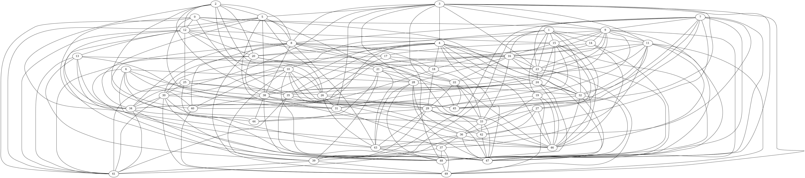

# friends
## Simulation shows that even with friendships assigned at random, most people's friends have more friends (on average) than they do.
This fact is show with real data by Scott L. Feld in [Why Your Friends Have More Friends than You Do](https://fermatslibrary.com/s/why-your-friends-have-more-friends-than-you-do#email-newsletter).

Here we use a simulation written in C to show the same thing.

It's no coincidence that the mean of the "Friends (average) of friends" data is exactly 11. The general rule, also mentioned by Feld, is that the mean for that group will be the mean of the "Friends" group plus its variance divided by the mean. The variance in this case (square of the standard deviation) appears to be the same as the mean, 10. That is a characteristic of data with a Poisson distribution.

The simulation code [friends.c](friends.c) is provided with instructions in the comments. It compiles and runs on Linux, and probably others. It outputs CSV which can be imported by Excel. It optionally outputs a .dof file that can be processed with Graphviz.org utilities, but only for small populations.

Here is the network map of a group of just 50 friends, with friendships assigned at random.

