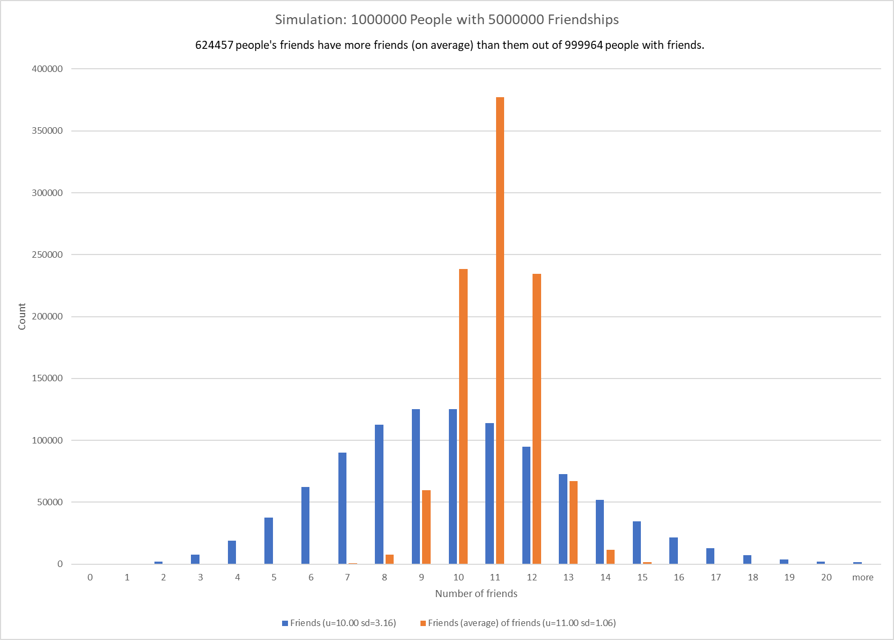

# friends
## Simulation shows that even with friendships assigned at random, most people's friends have more friends (on average) than they do.
This fact is show with real data by Scott L. Feld in [Why Your Friends Have More Friends than You Do](https://fermatslibrary.com/s/why-your-friends-have-more-friends-than-you-do#email-newsletter).

Here we use a simulation written in C to show the same thing.

The simulation code friends.c is provided with instructions in the comments. It compiles and runs on Linux, and probably others. It outputs CSV which can be imported by Excel. It optionally outputs a .dof file that can be processed with GraphViz.org utilities, but only for small populations.
